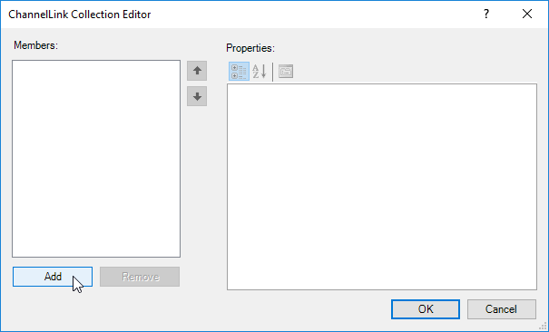
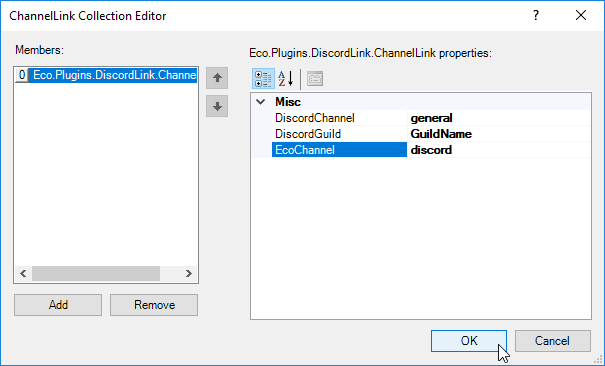

# DiscordLink Configuration

* [Linking Channels](#linking-channels)

## Linking Channels

1. Navigate to your server GUI, and navigate to the tab "DiscordLink". The box you're interested in is called "ChannelLinks". Click on the three dots next to the box saying "(Collection)". This may be hidden until you mouse over it.

2. In the new window that just appeared, click "Add" in the bottom left. This adds a new link.

3. Enter the name of the Discord channel you want to link to Eco, the name of the Discord server the channel is in, and the Eco channel name to link. Then hit "Ok"

4. You're done!