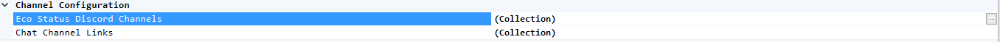
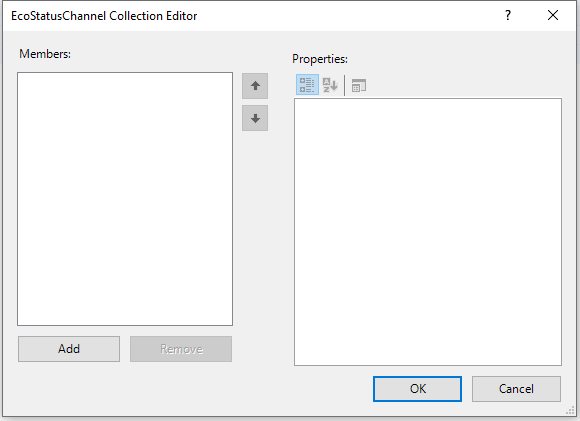
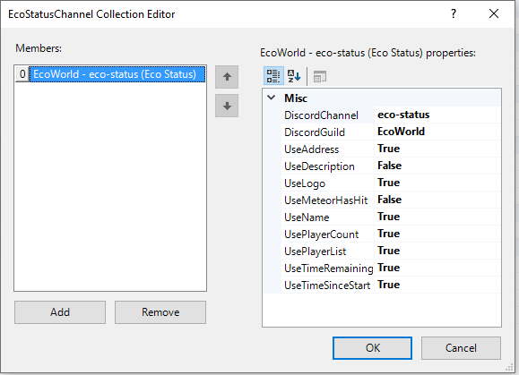

# DiscordLink Configuration
Navigate to your server GUI, and navigate to the tab "DiscordLink". 
From here, you can manipulate all configuration options available and most of them will take effect without requiring a server restart.

#### Sections
* [Bot Token](#bot-token)
* [Linking Channels](#linking-channels)
* [Eco Status](#eco-status)
* [Chat Log](#chat-log)
* [Command Settings](#command-settings)
* [Server Details](#server-details)

## Bot Token
See the [installation guide](Installation.md)

## Linking Channels

1. The box you're interested in is called "ChatChannelLinks". Click on the three dots next to the box saying "(Collection)". This may be hidden until you mouse over it.

2. In the new window that just appeared, click "Add" in the bottom left. This adds a new link.

3. Enter the parameters for the channel link. _"DiscordChannel"_ should be the Discord channel you want to link to Eco. For example, "general". _"DiscordGuild"_ is the name of the Discord Server, for example "Eco" for the official Eco Discord. Both _DiscordChannel_ and _DiscordGuild_ accept names or IDs. _"EcoChannel"_ is the channel in Eco you want to link to Discord, for example "General". Once entered, hit "OK".  
**Optional**: Configure the three flags for Discord mention tag permissions according to your preference of allowing role, user and Channel mentions to be used from Eco.

4. You're done! All messages sent into the configured Discord channel and Eco chat channel should now be crossposting all player messages.

## Eco Status

1. Locate the box called "Eco Status Discord Channels". Click on the three dots next to the box saying "(Collection)". This may be hidden until you mouse over it.

2. In the new window that just appeared, click "Add" in the bottom left. This creates a new entry for an Eco status channel in Discord.

3. Enter the parameters for the Eco status Discord Channel. _"DiscordChannel"_ should be the Discord channel you want the status message to be posted in. For example, "eco-status". _"DiscordGuild"_ is the name of the Discord Server, for example "Eco" for the official Eco Discord. Both _DiscordChannel_ and _DiscordGuild_ accept names or IDs. Once entered, hit "OK".  
**Optional**: Configure the usage flags according to your preferences.  

**Note**: Only one message will be posted and that message will then be kept up to date by DiscordLink through frequent automatic edits.

## Chat Log
To enable/disable logging of the chat, toggle the _"Log Chat"_ option in the _"ChatLog Configuration"_ section of the DiscordLink configuration options.
**Optional**: Select where the log should be stored.  
Keeping it in the mod directory is recommended in order to make sure the mod has permissions to write to files at the location and to keep it excluded from actions taken by the Eco server.

## Command Settings
**Discord Command Prefix**  
The prefix to put before commands in order for the Discord bot to recognize them as such.  
In all command examples `?` is used as Discord command prefix as this is the default prefix.
Eco commands always use `/` as command prexis as this is hard coded into the game client.

**Eco Command Channel**  
The Eco chat channel to use for commands that outputs public messages, excluding the initial # character.

**Invite Message**  
The message to use for the /DiscordInvite command. The invite link is fetched from the Network configuration (the _Discord Address_ field) and will replace the [LINK] token. The message needs to include at least one [LINK] token in order to function and the _Network_ configuration needs to have the _Discord Address_ field filled out.

## Server Details
All fields here are for display purposes only and will not impact the functionality of DiscordLink.
The name, IP address and other fields here will be used for example in the Eco Status feature to show the users on Discord what the name and IP of the server is.
Where possible, information from the Eco server configuration will be used here for fields that are not filled.
