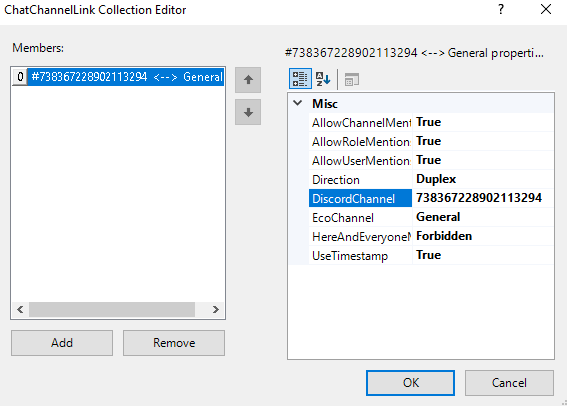

# DiscordLink Configuration
Navigate to your server GUI, and navigate to the tab "DiscordLink". 
From here, you can manipulate all configuration options available and most of them will take effect without requiring a server restart.

#### Sections
* [Bot Token](#bot-token)
* [Linking Channels](#linking-channels)
* [Chat Log](#chat-log)
* [Command Settings](#command-settings)
* [Server Details](#server-details)

## Bot Token
See the [installation guide](Installation.md)

## Linking Channels

1. The box you're interested in is called "Chat Channel Links" and it is located in the subcategory "Feeds". Click on the three dots next to the box saying "(Collection)". This may be hidden until you mouse over it.

2. In the new window that just appeared, click "Add" in the bottom left. This adds a new link.

3. Enter the parameters for the channel link. _"DiscordChannel"_ should be the Discord channel you want to link to Eco. For example, "general". _"DiscordGuild"_ is the name of the Discord Server, for example "Eco" for the official Eco Discord. Both _DiscordChannel_ and _DiscordGuild_ accept names or IDs. _"EcoChannel"_ is the channel in Eco you want to link to Discord, for example "General". Once entered, hit "OK".  

4. You're done! All messages sent into the configured Discord channel and Eco chat channel should now be cross posting all player messages.

## Displays, Feeds and Inputs
All displays, feeds and inputs require a [Channel Link](#linking-channels) and will be considered turned off until a valid one exists.
For more information, see the [Modules Page](Modules.md).

## Eco Bot Name
The name the bot should use when posting in Eco.
Note that the bot user is created when the server starts for the first time after a world reset and therefore, changing this will only take effect after the next world reset.

## Chat Log
To enable/disable logging of the chat, toggle the _"Log Chat"_ option in the _"ChatLog Configuration"_ section of the DiscordLink configuration options.
**Optional**: Select where the log should be stored.  
Keeping it in the mod directory is recommended in order to make sure the mod has permissions to write to files at the location and to keep it excluded from actions taken by the Eco server.

## Logging
The _Log Level_ and _Backend Log Level_ should generally be kept at their defaults unless you are troubleshooting an issue or want to turn off the output in the Eco server log.

**Notes**
* All message types below the selected one will be printed as well.
* All non-verbose and non-backend log messages are written to a separate log in "Configs/Mods/DiscordLink/Pluginlog.txt", regardless of log settings.
* If the backend log level is raised, it is normal to see warnings like "Pre-emptive ratelimit triggered". This simply means that the underlying communications library delayed a message in order to make sure that we do not hit Discord's rate limit.

## Command Settings
**Discord Command Prefix**  
The prefix to put before commands in order for the Discord bot to recognize them as such.  
In all command examples `?` is used as Discord command prefix as this is the default prefix.
Eco commands always use `/` as command prefix as this is hard coded into the game client.

**Admin Roles**  
The Discord roles for which to allow the use of admin commands. Role names are case insensitive.

**Eco Command Channel**  
The Eco chat channel to use for commands that outputs public messages, excluding the initial # character.

**Max Tracked Trades Per User**
The maximum amount of tracked trades allowed for each user.
Note that lowering this will not remove any existing tracked trades.

**Invite Message**  
The message to use for the /DiscordInvite command. The invite link is fetched from the Network configuration (the _Discord Address_ field) and will replace the [LINK] token. The message needs to include at least one [LINK] token in order to function and the _Network_ configuration needs to have the _Discord Address_ field filled out.

## Server Details
All fields here are for display purposes only and will not impact the functionality of DiscordLink.
The name, IP address and other fields here will be used for example in the Eco Status feature to show the users on Discord what the name and IP of the server is.

Where possible, information from the Eco server configuration will be used here for fields that are not filled.