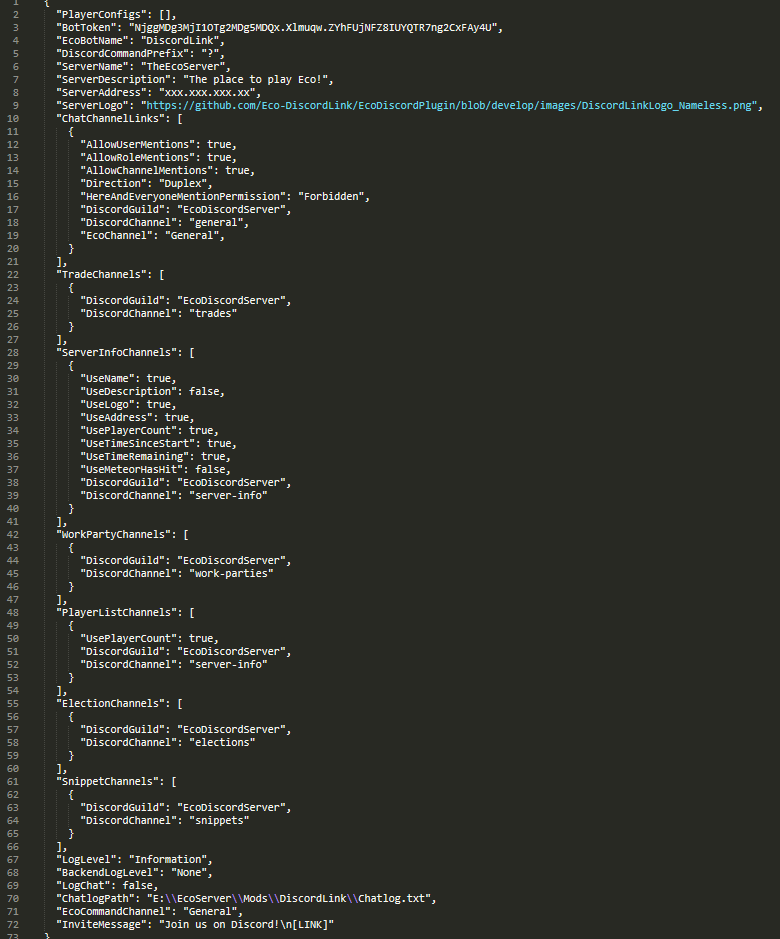

# DiscordLink Configuration
As we don't have access to the eco server GUI, we will need to do the configuration via the DiscordLink config file.
The config file is named "DiscordLink.eco" is generated inside the _"Config"_ directory of the Eco Server after having started the server once with the mod loaded.

#### Sections
* [Sample Config](#sample-config)
* [Bot Token](#bot-token)
* [Linking Channels](#linking-channels)
* [Chat Log](#chat-log)
* [Command Settings](#command-settings)
* [Server Details](#server-details)

## Sample Config
See this page for a text version of the [sample config](SampleConfig.md)

## Bot Token
See the [installation guide](Installation.md) for instructions on how to get a bot token.  
Once you have a bot token, copy the _"BotToken"_ field in the sample config and paste your generated bot token.

## Linking Channels
1. Copy the _"ChatChannelLinks"_ section of the sample config into your config file.
2. Set _"DiscordGuild"_ field to the name or ID of your Discord Server.
3. Set the _"DiscordChannel"_ field to the name or ID of the Discord channel you wish to synchronize with a channel in Eco.
4. Set the _"EcoChannel"_ field to the name of the Eco channel you wish to synchronize with the Discord channel in the previous step.
5. **Optional**: Configure the three flags for Discord mention tag permissions according to your preference of allowing role, user and Channel mentions to be used from Eco.
5. **Optional** Configure the _"Direction"_ field to only allow messages to be forwarded in one direction.

## Displays, Feeds and Inputs
All displays, feeds and inputs require a [Channel Link](#linking-channels) and will be considered turned off until a valid one exists.
For more information, see the [Modules Page](Modules.md).

## Eco Bot Name
The name the bot should use when posting in Eco.
Note that the bot user is created when the server starts for the first time after a world reset and therefore, changing this will only take effect after the next world reset.

## Chat Log
To enable/disable logging of the chat, set the _"Log Chat"_ option to true/false.  
**Optional**: Select where the log should be stored by entering an **absolute** file path.  
Keeping it in the mod directory is recommended in order to make sure the mod has permissions to write to files at the location and to keep it excluded from actions taken by the Eco server.

## Logging
The _Log Level_ and _Backend Log Level_ should generally be kept at their defaults unless you are troubleshooting an issue or want to turn off the output in the Eco server log.

All non-verbose and non-backend log messages are written to a separate log in "Mods/DiscordLink/Pluginlog.txt", regardless of log settings.

The potential values for Log Level is:
* Debug Verbose
* Debug
* Warning
* Information
* Error
* Silent

The potential values for Backend Log Level is:
* Trace
* Debug
* Information
* Warning
* Error
* Critical
* None

**Notes**
* All message types below the selected one will be printed as well.
* All non-verbose and non-backend log messages are written to a separate log in "Mods/DiscordLink/Pluginlog.txt", regardless of log settings.

## Command Settings
**Discord Command Prefix**  
The prefix to put before commands in order for the Discord bot to recognize them as such.  
In all command examples `?` is used as Discord command prefix as this is the default prefix.  
Eco commands always use `/` as command prefix as this is hard coded into the game client.

**Admin Roles**
The Discord roles for which to allow the use of admin commands. Role names are case insensitive.

**Eco Command Channel**  
The Eco chat channel to use for commands that outputs public messages, excluding the initial # character.

**Max Tracked Trades Per User**
The maximum amount of tracked trades allowed for each user.
Note that lowering this will not remove any existing tracked trades.

**Invite Message**  
The message to use for the /DiscordInvite command. The invite link is fetched from the Network configuration (the _Discord Address_ field in _Network.eco_) and will replace the [LINK] token. The message needs to include at least one [LINK] token in order to function and the _Network_ configuration needs to have the _Discord Address_ field filled out.

## Server Details
All fields here are for display purposes only and will not impact the functionality of DiscordLink.
The name, IP address and other fields here will be used for example in the Eco Status feature to show the users on Discord what the name and IP of the server is.

Where possible, information from the Eco server configuration will be used here for fields that are not filled.
