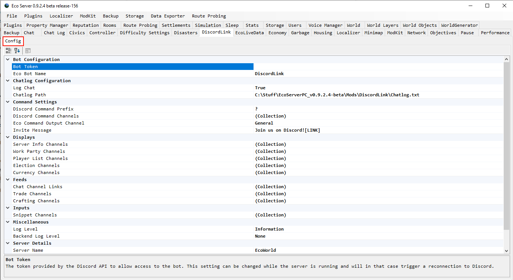
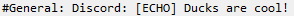

# How to install the DiscordLink plugin on your Eco Server.

Note: If you do _*not*_ have access to the server GUI, you can still use this quide, but will need to input the required values manuelly. Copy the config template file in the _config_ folder of your server, name it _"DiscordLink.eco"_ and fill in the values directly in the file. Documentation for doing this can be found in the [configuration guide](ConfigurationNoGUI.md).

### 1. Download the latest DiscordLink release .zip file from <https://github.com/Eco-DiscordLink/EcoDiscordPlugin/releases>.

### 2. Go to your server's main folder (The one with the .exe), extract the .zip there and start your server.

### 3. When the server has loaded, navigate to the DiscordLink configuration tab. You'll see a configuration box labelled "BotToken". We need to go create one.

If you are not using the server GUI, you instead need to fill out this field in the _"DiscordLink.eco"_ config file.

### 4. Navigate to <https://discordapp.com/developers/applications/me>. Login to Discord and click "New App".

### 5. Name your bot appropriately (this will be the bot's name on your Discord server).

### 6. Click the section labelled "Bot". Click "Create a Bot User".

### 7. Click "Add Bot"

### 8. This section will now contain the token we need. Click the copy button to get the token into your clipboard.

### 9. Paste the token into the "BotToken" section of the server GUI. If you check the server's console, you should see "Connected to Discord". If you don't, double check your token. Note that if you are not using the GUI, you will need to restart the server manually.

### 10. Navigate back to the bot's page on the Discord website (see above). Copy the "Application ID" that appears at the top - you will need it in the next section.

### 11. Before you leave the bot's page, enable the "Server Members Intent" for your bot. This allows DiscordLink to read the full member list of Discord Servers. This is needed for linking Eco and Discord accounts.

### 12. Go to <https://discordapi.com/permissions.html#216064>. Paste the Application ID in the bottom left field labelled "Application ID", and add any extra permissions you want the bot to have. Click the link at the bottom.

### 13. Set the server you want to invite the bot to, then click "Continue".

### 14. Check your Discord server to see that the bot is online when the server is running.
**Offline**

**Online**

### 15 Set up a [Chat Channel Link](ConfigurationGUI.md)

### 16 Run the _"Echo"_ command in the Discord channel specified in the Chat Channel Link to see that it is working properly. Make sure that the bot has permissions to read and send messages.

**Echo command**

**Discord server GUI chat display showing that the message reached the Eco server**

**Discord bot crosspost if a [Channel Link](ConfigurationGUI.md) has been set up**

### 17. You're done! [Configure](ConfigurationGUI.md) any other options you want in server GUI, or change the Bot's permissions as if they're any other user in Discord.
