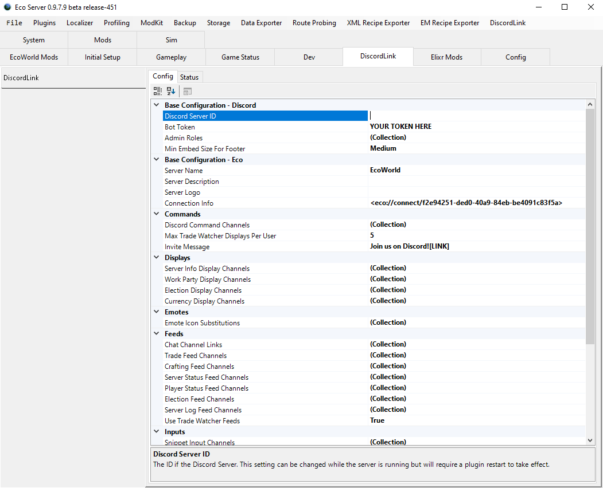

# How to install the DiscordLink plugin on your Eco Server.

Note: If you do _*not*_ have access to the server GUI, you can still use this quide, but will need to input the required values manually. Copy the config template file in the _config_ folder of your server, name it _"DiscordLink.eco"_ and fill in the values directly in the file. Documentation for doing this can be found in the [configuration guide](ConfigurationNoGUI.md).

If you encounter problems, remember that Discordlink has [troubleshooting commands](Commands.md#SAT) and that you can get support in the [Eco Modding Discord](https://discord.gg/pCkWfzQ), just scroll down to the *DiscordLink* section and post in the *help* channel!

---------------

### 1. Download the latest DiscordLink release .zip file from <https://github.com/Eco-DiscordLink/EcoDiscordPlugin/releases>.

### 2. Go to your server's main folder (The one with the .exe), extract the .zip there and start your server.

### 3. When the server has loaded, navigate to the DiscordLink configuration tab. You'll see a configuration box labelled "BotToken". We need to go create one.

If you are not using the server GUI, you instead need to fill out this field in the _"DiscordLink.eco"_ config file.

### 4. Navigate to <https://discordapp.com/developers/applications/me>. Login to Discord and click "New Application".

### 5. Name your bot appropriately (this will be the bot's name on your Discord server).

### 6. Click the section labelled "Bot". Click "Create a Bot User".

### 7. Click "Add Bot"

### 8. This section will now contain the token we need. Click the copy button to get the token into your clipboard.

### 9. Go back to the Eco server configuration and paste the token into the "BotToken" field.

### 10. Enter the name or ID of your Discord server into the "Discord Server" field.

### 11 Restart the DiscordLink plugin to make the changes take effect.

### 12. Navigate back to the bot's page and the "General Information" tab on the Discord website (see above). Copy the "Application ID" - you will need it in the next section.

### 13. Before you leave the bot's page, enable the "Server Members Intent" and "Message Content Intent" for your bot.
* The Server members intent allows DiscordLink to search for users in your Discord server when trying to link an Eco account to a Discord account.
* The Message Content Intent will be needed for DiscordLink to function past 2022-04-30.

### 14. Go to <https://discordapi.com/permissions.html#268659776>. Paste the Application ID in the bottom left field labelled "Client ID", and add any extra permissions you want the bot to have. Click the link at the bottom.

### 15. Set the server you want to invite the bot to, then click "Continue".

### 16. Check your Discord server to see that the bot is online when the server is running.
**Offline**

**Online**

### 17 Set up a [Chat Channel Link](ConfigurationGUI.md).

### 18 Verify that the config is correct by running the [VerifyConfig](#Commands.md) command or by selecting it in the DiscordLink dropdown in the server GUI.

### 19 Make sure that the bot has the required permissions by running the [VerifyPermissions](#Commands.md) command or by selecting it in the DiscordLink dropdown in the server GUI.

### 20 Run the _"Echo"_ [command](#Commands.md) in the Discord channel specified in the Chat Channel Link to see that it is properly sending message to Eco and receiving messages back. 

**Echo command**  
  

**Discord server GUI chat display showing that the message reached the Eco server.**  
  

**Crosspost back to Discord showing that DiscordLink caught the message and forwarded it as configured in the Chat Channel Link cofiguration.**  
  

### 21. You're done! [Configure](ConfigurationGUI.md) any other options and features you want and enjoy using DiscordLink!  
