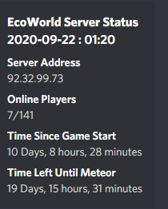
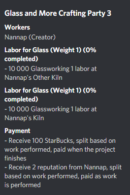
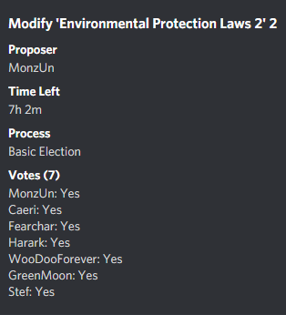
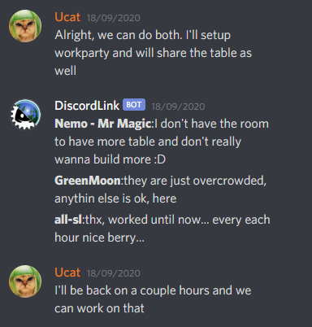
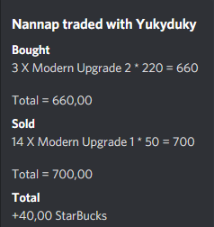
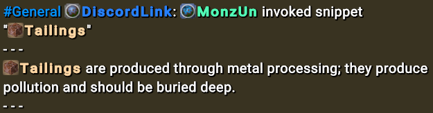

# Integration Features

#### Sections
* [Displays](#displays)
	* [Server Info](#server-info)
	* [Player List](#player-list)
	* [Work Parties](#work-parties)
	* [Elections](#elections)
* [Feeds](#feeds)
	* [Chat](#chat)	
	* [Trade](#trade)	
* [Inputs](#inputs)
	* [Snippets](#snippets)

## Displays
A Discord Display makes persistent information in Eco visible in Discord.  
It does this by regularly (once every ~60 seconds) fetching information from the Eco server and sending/editing a message in Discord to keep the Display up to date. Some events in Eco will also update displays related to those events.  

### Server info
Displays a single message that contains customizable information about the server such as name, address, time since start and more.  

### Player List
Displays a single message that contains the list of currently online players.  

### Work Parties
Displays one message per work party, containing information about the status of that work party.  

### Elections
Displays one message per election, containing information about the status of that election.  
Note that in the case of a non-boolean election, only the highest ranked option will be listed for each player in the votes.  

## Feeds
A Feed will output information from Eco into Discord (or vice versa) as it becomes available.

### Chat
Sends Discord messages to Eco and vice versa. Can be configured to only feed messages one way.  

### Trade
Displays trade events in Discord as they occur in Eco.  

## Inputs
An Input is a source of information in Eco or Discord that can be utilized in commands or other features.  
**Note**: The range for how far in the Discord message history Input messages can be found is limited.

### Snippets
Snippets are messages posted in Discord that can be reposted in Eco using the /Snippet command.  

Syntax for Snippets in Discord:  
> [Snippet] [\<SnippetName\>]  
> \<Snippet text>  

  
  
