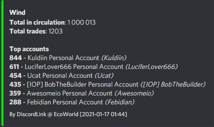
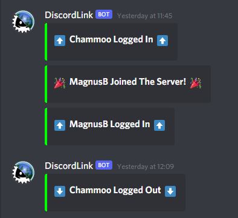
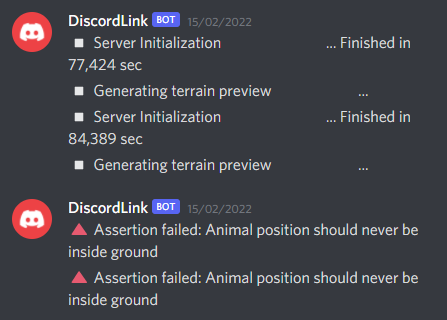
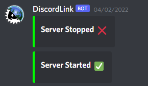
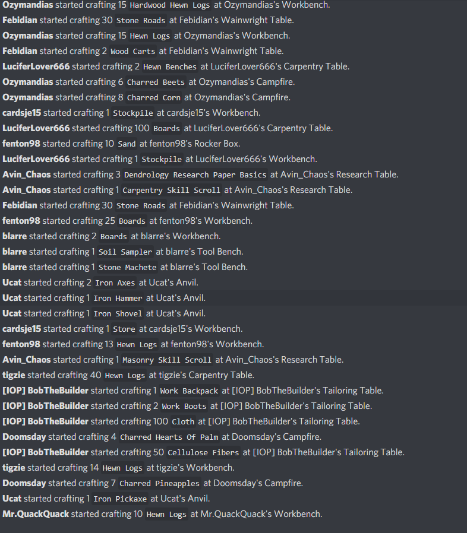
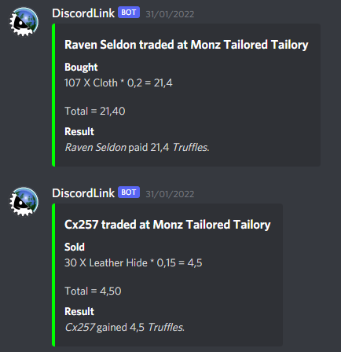
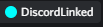
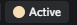
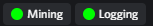

# Modules

#### Sections
* [Displays](#displays)
	* [Server Info](#server-info)
	* [Player List](#player-list)
	* [Work Parties](#work-parties)
	* [Elections](#elections)
* [Feeds](#feeds)
	* [Chat](#chat)	
	* [Player Status](#player-status)	
	* [Trade](#trade)	
	* [Server Log](#server-log)	
	* [Server Status](#server-status)	
* [Watchers](#watchers)
	* [Trade Feed](#trade-feed)
* [Roles](#roles)
	* [Account Link](#account-link)
	* [Demographics](#demographics)
	* [Specializations](#specializations)
* [Inputs](#inputs)
	* [Snippets](#snippets)

## Displays
A Discord Display makes persistent information in Eco visible in Discord.  
It does this by regularly (once every ~60 seconds) fetching information from the Eco server and sending/editing a message in Discord to keep the Display up to date. Some events in Eco will also update displays related to those events.  

### Server info
Displays a single message that contains customizable information about the server such as name, connection info, online players, active laws and more.  

### Work Parties
Displays one message per work party, containing information about the status of that work party.  

### Elections
Displays one message per election, containing information about the status of that election.  
Note that in the case of a non-boolean election, only the highest ranked option will be listed for each player in the votes.  

### Currencies
Displays one message per existing currency up to a configurable limit and ordered by the amount of trades made in the currency during the current cycle.
For each currency, a configurable amount of users holding the highest amounts of the currency will be shown.
Can be configured to only show minted or credit currencies based on the existance of a minted currency.

## Feeds
A Feed will output information from Eco into Discord (or vice versa) as it becomes available.

### Chat
Sends Discord messages to Eco and vice versa. Can be configured to only feed messages one way.  

### Player Status
Sends notifications when a player logs in/out or joins the server.  

### Trade
Displays trade events in Discord as they occur in Eco.  

### Server Log
Forwards Eco server log messages to Discord.  

### Server Status
Sends notifications when the server comes online or goes offline.  

### Crafting
Displays crafting events in Discord as they occur in Eco.  

## Watchers
A watcher is a personal feed or display that [linked users](AccountLinking.md) can configure to display information in DMs with the bot.  

### Trade Feed
Works like the [Trade Feed](#trade) but the notifications are sent to the bot DM channel and the player can customize what should be shown. A Trade Feed Watcher is set up using the [AddTradeWatcherFeed](Commands.md) command and can be customized to filter entries by Player, Tag, Item or Store.  
  

### Trade Display
Works like a display for a DL-Trade [command](Commands.md). A trade display is set up using the [AddTradeWatcherDisplay](Commands.md) command and can be customized to filter entries by Player, Tag, Item or Store.  

## Roles
Roles can be set for [linked users](AccountLinking.md) based on game data.  

### Account Link
Gives linked users a role in Discord to show that they have linked theur account.  
  

### Demographics
Gives linked users roles matching their ingame demographics.  

### Specializations
Gives linked users roles matching their ingame specializations.  

## Inputs
An Input is a source of information in Eco or Discord that can be utilized in commands or other features.  
**Note**: The range for how far in the Discord message history Input messages can be found is limited.  

### Snippets
Snippets are messages posted in Discord that can be reposted in Eco using the /Snippet command.  

Syntax for Snippets in Discord:  
> [Snippet] [\<SnippetName\>]  
> \<Snippet text>  

  
  
